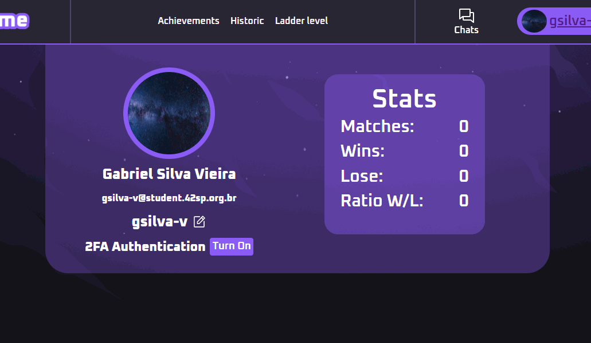
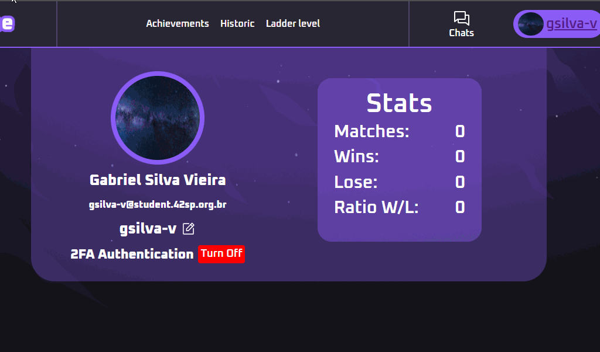

# Doc Api

## Autenticação de Dois Fatores (TFA)

### Funcionamento:
Quando o usuario decide ativar a autenticação, um email é configurado
para receber os codigos de autenticação.

Esse email é enviado a nossa api e configurado no banco de dados, e,
durante a configuração ainda, um código de verificação já é enviado
a esse email para o validar e comprovar que é do usuario.

Depois de configurado, sempre que o usuario fizer login na plataforma,
ele deverá solicitar um código e validar seu login.

Também é posivel desabilitar essa autenticação, restando apenas a validação
da intra.

